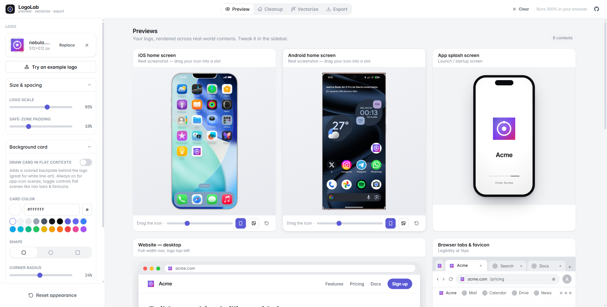
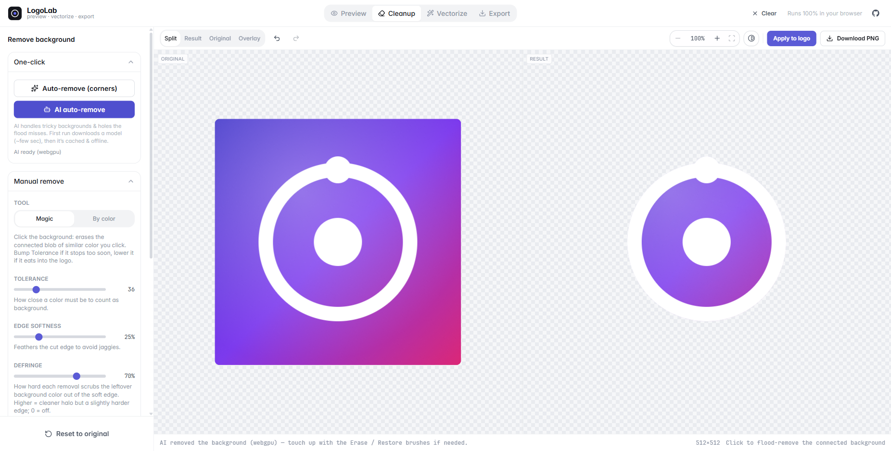
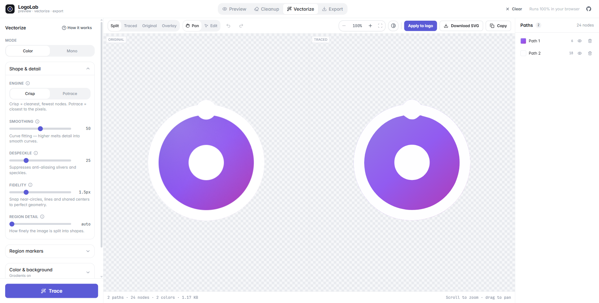
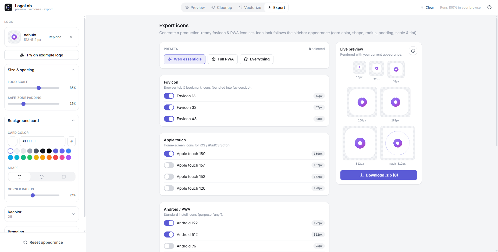

<div align="center">

# 🔬 LogoLab

### Drop in a logo → preview it in real-world contexts → clean it up, vectorize it, and export a production-ready icon set.

**100% in your browser. No uploads, no backend, no sign-up.**

[**GitHub repo**](https://github.com/Blaxzter/LogoLab) · [Report an issue](https://github.com/Blaxzter/LogoLab/issues)



</div>

---

You just generated an app icon / logo with Midjourney, Gemini, DAL·E, or your favourite
vector tool — but does it actually *work*? Is it legible at 16px? Does that white line-art
mark disappear on a light nav bar? How does it look as an iOS app icon, or cropped into a
circular avatar?

**LogoLab** answers all of that in one place, then helps you ship the asset: remove the
junk background, trace it to a clean SVG, and export every favicon / PWA icon you need.

> No logo handy? Hit **Try an example logo** in the sidebar to load one of the built-in
> samples and play with every tool right away.

## ✨ Features

### 🖼️ Preview in real contexts
See your logo composited into **real device screenshots** (drag it into any app slot), plus
a desktop website nav, browser tabs & favicons, an app splash screen, an App Store listing,
a circular social avatar, and a size-&-contrast matrix (16 → 128px on light *and* dark).

- **Background card** — give a white / line-art logo a colored backplate (color, shape,
  radius, shadow). The classic "my logo vanishes on white" fix.
- **Recolor (tint)** — repaint a monochrome mark in any brand color via its alpha, plus
  one-click invert.
- **Light / dark** context toggle and a custom page background.
- **🎯 Live favicon** — the logo you're working on becomes this tab's favicon in real time.

### 🧽 Cleanup — background remover
A magic-wand / flood-fill eraser **plus hand brushes and an AI cutout** for AI-generated icons
that ship with a baked background.



- **One-click removers:** **Auto-remove** (floods the four corners) and **🤖 AI auto-remove** —
  a Hugging Face segmentation model (`briaai/RMBG-1.4`) that runs **entirely in your browser**
  and handles tricky backgrounds and the enclosed holes the corner flood can't reach. The model
  (~tens of MB) downloads on first use, then is cached & offline — nothing is ever uploaded.
- **Manual tools:** **Magic** (flood-fill a connected region), **By color** (key out one color
  everywhere), and **Erase / Restore** brushes — drag to rub out leftovers by hand or paint the
  original back where you went too far, with an adjustable brush size.
- **Tolerance** + **edge-softness** (anti-aliased cuts) + **defringe**, full **undo / redo**
  (incl. `Ctrl/⌘+Z` · `Ctrl/⌘+Shift+Z`) and **reset**.
- **Flip background** toggles the canvas between a light and dark transparency checkerboard, so
  white / light line-art logos stay visible while you work.
- **Apply** feeds the clean transparent PNG straight into preview, vectorize, and export.

### ✏️ Vectorize — a small in-browser vector studio
A **structure-first** tracer that segments the image by smoothness, fits a paint model
(flat, gradient or layered glow) to each region, then traces clean curves — plus a full
node editor, all client-side. The research behind each stage is in
[🔬 Algorithms & papers](#-algorithms--papers) below.



- **Clean curves, not staircases:** the default **Crisp** engine melts each mask into a
  sub-pixel coverage field, contours it (marching squares) and fits minimal Béziers with
  genuinely sharp corners; **Potrace** is one click away for the most pixel-faithful trace.
  Regions are stacked so adjacent shapes overlap instead of leaving hairline seams.
- **Gradients & translucency:** detects linear / radial gradients and rebuilds soft "glow"
  backgrounds and see-through overlapping shapes as real, editable gradient / translucent
  layers — not flat posterized bands.
- **Color** or **mono** tracing with **smoothing**, **despeckle** and **fidelity**
  (shape-snapping) dials, optional **remove background**, and **region markers** to protect
  spots the auto-merge would otherwise fuse.
- **Studio layout:** full-height workspace with **Split / Traced / Original / Overlay**
  (ghost) views, synced pan & zoom, a paths panel (select, recolor, hide, delete) and a
  **"How it works"** explainer that walks your image through every stage live.
- **Node editing, Affinity-style:** drag anchors & Bézier handles (smooth nodes mirror,
  `Alt` breaks symmetry), double-click a segment to add a node, double-click an anchor to
  toggle corner ↔ smooth, `Del` to remove, full **undo / redo**.
- Already-vector uploads can be **cleaned & edited directly** or re-traced from pixels.
- **Download** or **copy** the optimized SVG.

### 📦 Export — favicons & PWA icons
Generate a complete, production-ready icon set as a single `.zip`.



- Favicons (incl. a real multi-size **`favicon.ico`**), Apple touch, Android / Chrome,
  **maskable** icons (with safe-zone), and Windows tiles.
- A `manifest.webmanifest` and a copy-paste `<head>` snippet.
- Presets (**Web essentials / Full PWA / Everything**) and a live preview that follows your
  sidebar appearance (card color, shape, radius, padding, scale, tint).

## 🚀 Getting started

```bash
pnpm install
pnpm dev        # http://localhost:5173
pnpm build      # type-check + production build → ./dist
pnpm preview    # preview the production build
```

> Uses **pnpm**, but `npm` / `yarn` work too.

## ☁️ Deploy to Cloudflare Pages

It's a static SPA — the build output is `dist/`.

**Dashboard (Git):** Workers & Pages → Create → Pages → Connect to Git, then:
- **Framework preset:** Vite
- **Build command:** `pnpm build`
- **Build output directory:** `dist`

**Wrangler (direct upload):**

```bash
pnpm build
pnpm dlx wrangler pages deploy dist --project-name logolab
```

No environment variables or server routes required.

## 🛠️ Tech

- **React 19** + **TypeScript** (strict) + **Vite 8**
- **Tailwind CSS v4** (CSS-first `@theme` design tokens)
- **Zustand** for state
- **esm-potrace-wasm** (potrace tracing engine, GPL-2.0, lazily `import()`-ed) · **JSZip**
  (export) · **lucide-react** (icons)
- **@huggingface/transformers** (Transformers.js) for the in-browser AI background remover —
  lazily `import()`-ed so it never weighs down the initial bundle.
- Everything runs client-side via the Canvas & DOM APIs.

## 🔬 Algorithms & papers

The **Cleanup** and **Vectorize** views are small, self-contained reimplementations of
published computer-graphics research — all running client-side in pure TypeScript (plus WASM
for the two heavy engines). The full design rationale and per-stage implementation log lives
in [docs/vectorization-plan.md](docs/vectorization-plan.md).

### ✏️ Vectorize — structure-first tracing

The default **Crisp** engine follows a *structure-first* order — **segment by smoothness →
fit a paint model per region → trace geometry once → beautify** — instead of the classic
posterize-then-trace pipeline. It's a logo-scale reimplementation of Adobe's 2025
gradient-aware Image Trace.

| Stage / technique | What it does here | Introduced by |
|---|---|---|
| **Structure-first gradient reconstruction** | the overall segment → fit → trace architecture, and the Crisp engine | Chakraborty et al., [*Image Vectorization via Gradient Reconstruction*](https://research.adobe.com/publication/image-vectorization-via-gradient-reconstruction/), Eurographics / CGF **2025** |
| **Piecewise-smooth Mumford–Shah** | denoise into smooth colour fields + extract the edge / discontinuity map | [Mumford & Shah](https://en.wikipedia.org/wiki/Mumford%E2%80%93Shah_functional) **1989** (the functional); real-time discrete solver: Strekalovskiy & Cremers, [ECCV **2014**](https://link.springer.com/chapter/10.1007/978-3-319-10605-2_9) ([code](https://github.com/tum-vision/fastms)) |
| **CIELAB & Oklab colour difference** | perceptually-uniform thresholds for region merging and gradient-stop placement | [CIELAB ΔE76](https://en.wikipedia.org/wiki/Color_difference#CIE76); Ottosson, [*Oklab*](https://bottosson.github.io/posts/oklab/) **2020** |
| **Paint-model ladder (MDL selection)** | pick the cheapest paint that still fits — solid → linear → radial → glow | [Minimum Description Length](https://en.wikipedia.org/wiki/Minimum_description_length) — Rissanen **1978** |
| **Translucent-layer / glow-stack decomposition** | rebuild see-through overlapping shapes and soft "glow" backgrounds as stacked translucent layers | [ARDECO](https://inria.hal.science/inria-00105620/en/) (Lecot & Lévy, EGSR **2006**); [Photo2ClipArt](https://www-sop.inria.fr/reves/Basilic/2017/FLB17/) (Favreau et al., SIGGRAPH Asia **2017**); [Linear-Gradient Layer Decomposition](https://dl.acm.org/doi/10.1145/3592128) (Du et al., SIGGRAPH **2023**) |
| **Marker-controlled seeded region growing** | the **Mark** tool — each seed grows into its own region along the colour ridge | Adams & Bischof, [*Seeded Region Growing*](https://doi.org/10.1109/34.295913), IEEE TPAMI **1994** |
| **Marching squares** | sub-pixel iso-contour extraction from the coverage field | Lorensen & Cline, [*Marching Cubes*](https://doi.org/10.1145/37402.37422), SIGGRAPH **1987** (its 2-D analogue) |
| **Ramer–Douglas–Peucker** | reduce dense contours to key vertices | [Ramer 1972 / Douglas & Peucker 1973](https://en.wikipedia.org/wiki/Ramer%E2%80%93Douglas%E2%80%93Peucker_algorithm) |
| **Schneider Bézier fitting + soft-corner DP** | fit minimal cubic Béziers and keep genuine corners sharp by evidence, not a threshold | Schneider, [*Graphics Gems*](https://github.com/erich666/GraphicsGems) **1990**; corner / DP recipe after Baran et al. (CGF **2010**) and Kopf & Lischinski, [*Depixelizing Pixel Art*](https://johanneskopf.de/publications/pixelart/), SIGGRAPH **2011** |
| **Beautify / shape snapping** | snap near-circles, lines and shared centres to perfect primitives (algebraic circle fit) | Hoshyari et al., [SIGGRAPH **2018**](https://www.cs.ubc.ca/labs/imager/tr/2018/PerceptionDrivenVectorization/); [PolyFit](https://www.cs.ubc.ca/labs/imager/tr/2020/ClipArtVectorization/) (Dominici et al., SIGGRAPH **2020**); [ClipGen](https://arxiv.org/abs/2106.04912), TVCG **2021** |
| **k-means++ (deterministic seeding)** | palette generation + fallback decomposition | Arthur & Vassilvitskii, [*k-means++*](https://theory.stanford.edu/~sergei/papers/kMeansPP-soda.pdf), SODA **2007** |
| **Potrace** (alternative engine) | classic polygon-based bitmap tracing, one click away | Selinger, [*Potrace*](https://potrace.sourceforge.net/) **2003** |

### 🧽 Cleanup — background removal & matting

| Technique | What it does here | Introduced by |
|---|---|---|
| **Flood-fill magic wand + global colour key** | erase the connected background blob, or key one colour out everywhere — with green-weighted colour distance and feathered (anti-aliased) edges | classic [flood fill](https://en.wikipedia.org/wiki/Flood_fill) / chroma-keying |
| **AI cutout — RMBG-1.4** | in-browser saliency segmentation for tricky backgrounds and the enclosed holes the flood can't reach, via Transformers.js (WebGPU → WASM) | BRIA [RMBG-1.4](https://huggingface.co/briaai/RMBG-1.4), built on the **IS-Net** architecture — Qin et al., [*Highly Accurate Dichotomous Image Segmentation*](https://arxiv.org/abs/2203.03041), ECCV **2022**; runtime: [Transformers.js](https://huggingface.co/docs/transformers.js) |
| **Mathematical morphology** | grow / shrink the alpha matte (separable dilate & erode) in **Edge refine** | Serra, [*Image Analysis & Mathematical Morphology*](https://en.wikipedia.org/wiki/Mathematical_morphology), **1982** |
| **Three-pass box blur ≈ Gaussian** | feather the matte edge (three box passes ≈ a Gaussian, by the central-limit theorem) | Kovesi, [*Fast Almost-Gaussian Filtering*](https://www.peterkovesi.com/papers/FastGaussianSmoothing.pdf), **2010** |
| **Defringe / colour decontamination** | bleed the solid foreground colour across the soft edge to kill the leftover background halo | matte foreground-colour estimation |
| **Straight alpha-over compositing** | flatten the cutout onto a background colour and blend translucent layers | Porter & Duff, [*Compositing Digital Images*](https://dl.acm.org/doi/10.1145/800031.808606), SIGGRAPH **1984** |

## 📁 Project structure

```
src/
  components/
    scenes/        # preview mockups (DeviceMock, DesktopBrowser, AppStoreListing, …)
    panels/        # CleanupPanel, VectorizePanel, ExportPanel
    vectorize/     # the vectorize studio (EditorCanvas node editor, paths panel, controls)
    ui/            # Button + form controls
    LogoMark.tsx   # the single source of truth for rendering a logo (card/shape/tint)
  lib/
    bgRemove.ts    # flood-fill / color-key removal + erase/restore brushes
    aiRemove.ts    # lazy in-browser AI cutout (Transformers.js · RMBG-1.4)
    trace/         # potrace tracing pipeline (quantize → stacked masks → potrace WASM)
    path/          # editable vector model: SVG/path-d parser, serializer, Bézier node ops
    svgClean.ts    # SVG path rounding / optimization
    pwaExport.ts   # icon rendering, favicon.ico, manifest, zip
    image.ts       # loading, SVG rasterization, render sources
  hooks/
    useLiveFavicon.ts
  store.ts         # Zustand store (logo, appearance, environment, device placements)
public/mockups/    # device frames + screenshots used by the device previews
public/examples/   # built-in sample logos for the "Try an example" gallery
```

### How the device mockups work
Real device-frame PNGs have an opaque black screen, so LogoLab detects the screen region
(flood-fill from the center), **knocks it out** so the screenshot shows through, renders the
**bezel on top**, and draws a synthetic notch / punch-hole. Your logo is overlaid as a
draggable, resizable app icon. Drop in any frame + screenshot and it adapts — tune the
default icon placement in `defaultMockups` (`src/store.ts`).

## 📄 License

MIT — see [LICENSE](LICENSE).

---

<div align="center">
<sub>Built with <a href="https://claude.com/claude-code">Claude Code</a>.</sub>
</div>
